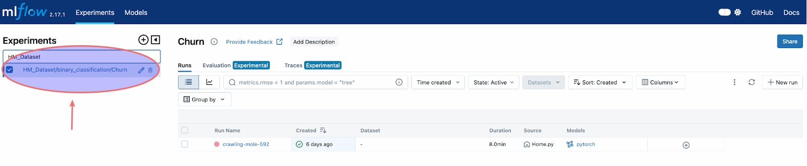
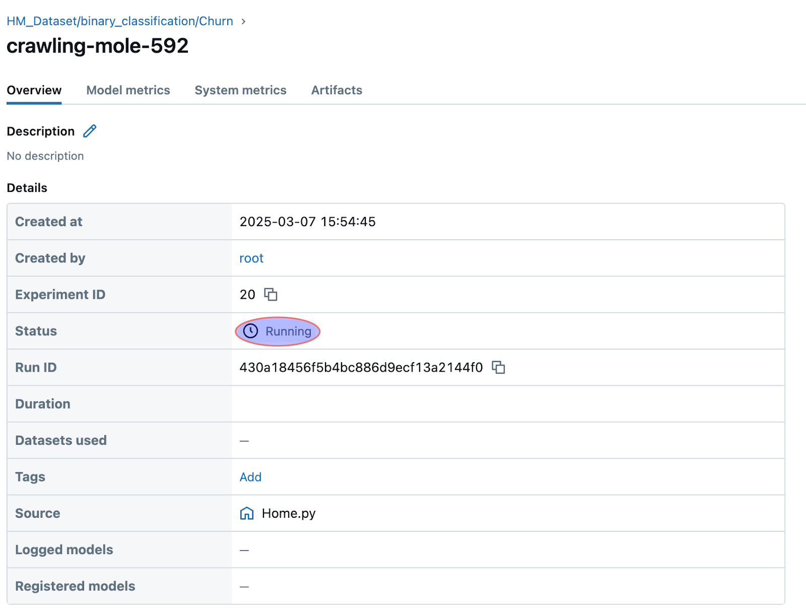
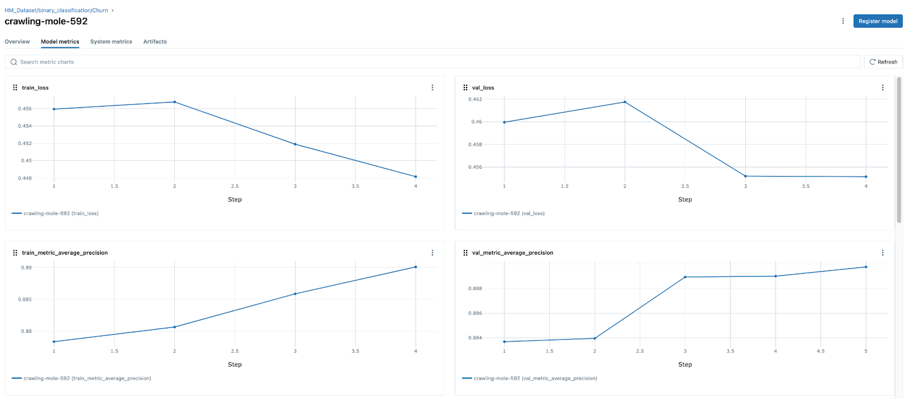
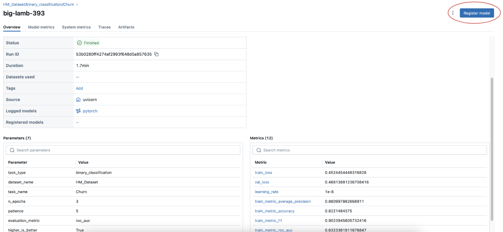
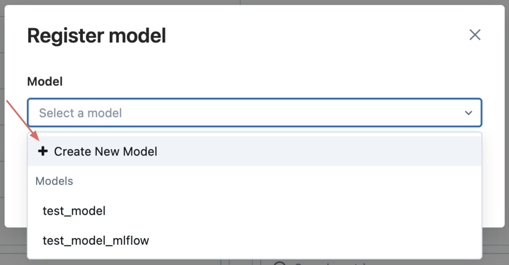
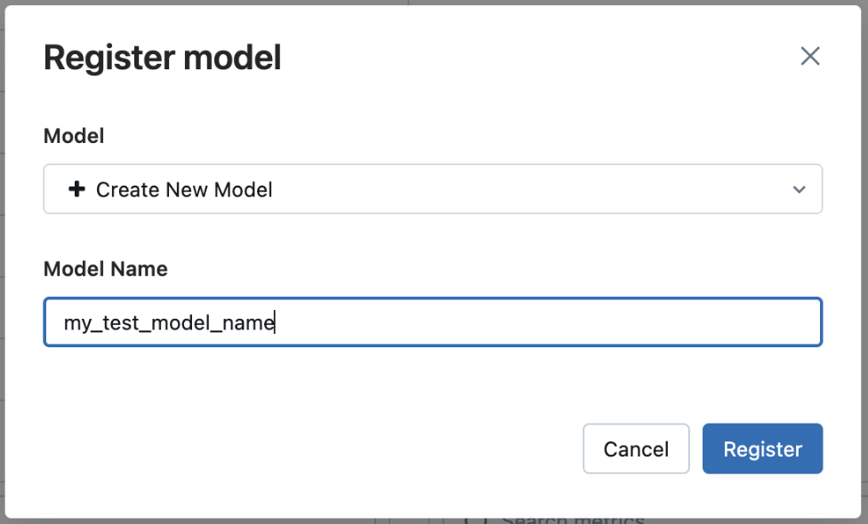

<a name="-mlflow"></a>

## 📈 MLflow

If desired, you can visit [MLflow](https://mlflow.org/) to monitor the training process in real time, including loss trends and evaluation metrics. For a detailed guide on how to use MLflow with the RelationalAI Native App, refer to the [instructions](/Docs/MLflow.md) here.

To access the MLflow page, inside a Snowflake notebook you can run:

```python
connector.mlflow_session_url
```

This will return a URL that you can use to access the MLflow page, where you'll authenticate with your Snowflake credentials.

Upon opening MLflow, you will see two main tabs: the **Experiments** tab and the **Models** tab. The **Experiments** tab displays a list of all your experiments on the left side. By selecting your current experiment `HM_Dataset/binary_classification/Churn`, you will see all models trained under that experiment listed on the main page, as shown in Figure 1 below. 


<p align="center">
  
</p>
<p align="center"><em>Figure 1: Example of an MLFLow experiments tracking section.</em></p>

Clicking on a specific model (here `crawling-mole-592`) will direct you to its detailed page, where you can track its progress.
If the model is still training, the `Overview` tab will indicate that its Status is `Running`, like shown in the Figure 2 below. 


<p align="center">
  
</p>
<p align="center"><em>Figure 2: Example of an MLFLow experiment overview.</em></p>


To analyze a model's  performance metrics in real time, navigate to the **Model Metrics** tab, where you can see key training statistics such as **training loss**, **validation loss**, **evaluation metrics**, and **learning rate** updates. These metrics are continuously updated as training progresses, allowing you to track improvements and detect any potential issues. Here is a figure showcasing an example of an MLFLow experiment metric tracking where we trained the model for 4 epochs:

<p align="center">
  
</p>
<p align="center"><em>Figure 3: Example of an MLFLow experiment metric tracking.</em></p>

As shown in the figure, there are several key metrics displayed during the model training process that can help you evaluate the model's performance:
* `train_loss`: This plot shows how the model's error decreases over time on the training data, indicating its progress in learning. A decreasing train loss signifies that the model is improving its ability to predict the training data.
* `val_loss`: Tracks the model's error on unseen validation data. This helps in detecting overfitting—if the validation loss starts to increase while the train loss continues to decrease, it may indicate the model is memorizing the training data rather than generalizing well.
* `train_metric_average_precision`: This measures how well the model correctly classifies the training data, reflecting its learning efficiency.
* `val_metric_average_precision`: This evaluates how well the model performs on unseen validation data, giving insight into its generalization ability.

After training multiple models, once you have identified a **satisfactory** one, you can proceed with **registering it for future use**. After registering it, you can perform inference on new, unseen data with this model refering to it by its **name** and **version**. So, to register a model, first navigate to its page by selecting the appropriate experiment (here: `HM_Dataset/binary_classification/Churn`) and then the model within the Experiments tab. Once on the model’s page, click the **"Register Model"** button, located in the top-right corner, as shown in Figure 4.

<p align="center">
  
</p>
<p align="center"><em>Figure 4: On the desired MLfLow model page click on Register model.</em></p>

You will then be presented with two options. The first option allows you to create a new model by clicking on **"+ Create New Model"**, where you can specify a **custom name** for it:

<p align="center">
  
</p>
<p align="center"><em>Figure 5: Click on Create New Model.</em></p>


<p align="center">
  
</p>
<p align="center"><em>Figure 6: Enter a custom name to specify your model.</em></p>

The second option lets you register the model **as a new version of an existing registered model**, in which case the newly trained model will be added as a version update to the selected model. After selecting the appropriate option, click **"Register"** to finalize the process.
