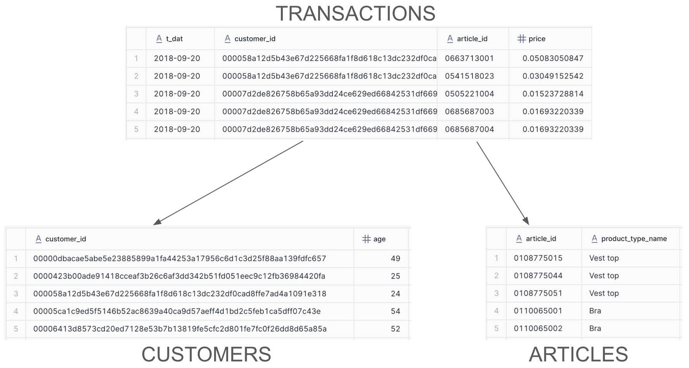

# GNN Tutorial: H&M Dataset

<!---
⚠️ **Attention:** [`rai_gnns_experimental.zip`](for_stage/rai_gnns_experimental.zip) was updated on **20 Aug 2025** — please re-download the latest version.
--->

## Table of Contents

- [Overview](#-overview)
- [Installation](#-installation)
- [Dataset Schema](#-dataset-schema)
- [Churn Prediction](#-churn-prediction)
- [Purchase Recommendation](#-purchase-recommendation)
- [Experiment Tracking](#-ExperimentTracking)

## 📘 Overview

In this tutorial, we’ll demonstrate how to use the **RelationalAI Native App**, available through the **Snowflake Marketplace**, to solve two common business challenges by leveraging our **graph neural networks' predictive reasoning capabilities (GNNs)**:

-**Customer Churn Prediction** – Predict whether a customer is likely to make a purchase in the upcoming week.

-**Purchase Recommendations** – Recommend relevant products (articles) tailored to each customer.

---

## 🛠️ Installation

To prepare the necessary data, tables, schemas, and other components for the two H&M use cases, follow the steps outlined in the [installation guide](/HM/installation.md). Once setup is complete, you can run the **Python notebooks** that were installed as part of the process.

---

## 📊 Dataset Schema

This schema consists of three tables:

- **CUSTOMERS** Table – Each row represents a customer and includes details such as age, residence area, and club membership. The table's candidate key is the `customer_id` column, which uniquely identifies each customer.

- **ARTICLES** Table – Each row represents a product (article), containing attributes like product name, product type, and color. The table's candidate key is the `article_id` column, which uniquely identifies each article. An article can be thought of as a product. 

- **TRANSACTIONS** Table – Each row describes a transaction, capturing which customer purchased which article, on what date, and at what price. This table references the `CUSTOMERS` and `ARTICLES` tables through the foreign key columns `customer_id` and `article_id`, respectively. There is no candidate key for this table.

  

<em>Figure 1: Sample schema of the H&M dataset.</em>

Based on this **schema**, we can define a **graph** where **each row** in **each table** corresponds to **a node**. This results in `customer`, `article`, and `transaction` nodes. **Edges** between nodes are defined by **candidate–foreign key relationships**.  In this schema, we have two types of edges: a **customer performs a transaction** (connecting a `customer` node to a `transaction` node), and an **article is purchased in a transaction** (connecting an `article` node to a `transaction` node).

---

## 📉 Churn Prediction

The first use case focuses on training a model that is able to predict whether a customer is likely to churn in the upcoming week.

This is a **node prediction task**, as we aim to make predictions for nodes of type `CUSTOMERS`. Since the prediction is a binary label (`1` = churn, `0` = no churn) the node prediction task is in more detail a **binary classification task**. 

To proceed, we must first create a **task table** that defines the prediction task. This table will contain training and validation examples for the model. It serves as a structured representation of the problem by specifying key entities from the database that are relevant to churn prediction. Additionally, it includes corresponding labels for each entity, providing the necessary supervision for the model to learn effectively. Optionally, this table also includes a time column that is crucial for some tasks as the one at hand. 

In our use case, the task table consists of three columns:
* Since we are predicting customer churn, the task table includes  `customer IDs`, representing the customer nodes for which predictions will be made. These values must match the candidate key values in the `CUSTOMERS` table of the database.
* Α `timestamp` column is also required, as a customer may be active one week but churn the next. 
* The task table contains  the ground truth label, which the GNN will learn to predict. The label is `0` (no churn) if the customer made a purchase in the week following the timestamp and `1` (churn) otherwise. We are going to store the labels in the `churn` column. We are showing how to create the task table in the [installation.md](/HM/installation.md).

To run this example you can use the [hm_churn_prediction.ipynb](/HM/for_stage/hm_churn_prediction.ipynb).

---

## 🛒 Purchase Recommendation

The second use case focuses on training a model that is able to generate personalized article recommendations for each customer. 

In order to achieve that, we are training the model to predict which articles a customer will purchase in the following week. This is a **link prediction task**, as we aim to predict edges between nodes of type `CUSTOMER` and `ARTICLE`. Specifically, this is a temporal link prediction task, where predictions depend on when the interaction occurs.

To proceed, we must first create a **task table** that defines the recommendation task. This table contains training and validation examples that the model will learn from. It serves as a structured representation of the problem by specifying the key entities and their interactions within a time window. Additionally, it includes a timestamp column to indicate when the prediction is being made, which is essential for temporal modeling.

In our use case, the task table consists of three columns:

* The `customer_id` column identifies the customer nodes for which the model will make predictions. These values must match the candidate key values in the `CUSTOMERS` table.
* The `article_id` column contains the articles (`article IDs`) that a customer purchased at a given date, representing the ground truth. These are the edges the GNN will learn to predict. These values must match the candidate key values in the `ARTICLES` table.
* The `timestamp` column specifies the reference date. The model is expected to predict the articles that the customer will purchase in the seven days following this timestamp.

This task formulation enables the model to learn personalized product recommendations that are both customer-specific and time-aware. We provide instructions for generating this task table in the [installation.md](/HM/installation.md).

To run this example you can use the [hm_purchase_recommendations.ipynb](/HM/for_stage/hm_purchase_recommendations.ipynb).

---

## 🧠 Experiment Tracking

In parallel with running the notebooks, you can use Snowflakes built in capabilities for experiment tracking.
See this [link](https://www.snowflake.com/en/developers/guides/getting-started-with-ai-observability/#examine-results) for a tutorial.

