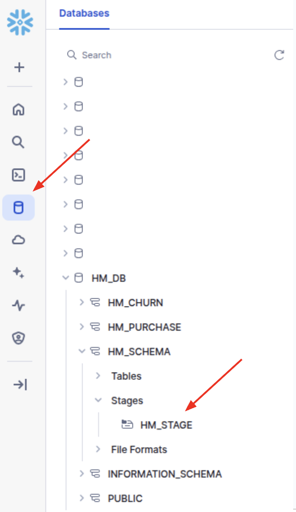
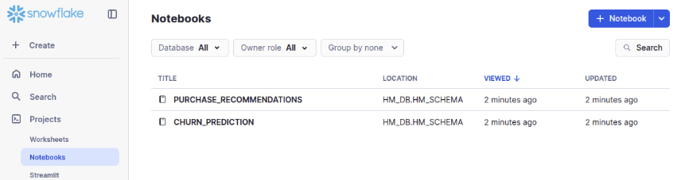

# Installation Instructions


The following section provides installation instructions for the code used to solve the churn prediction and purchase recommendation tasks using the H&M dataset.

## tl;dr

The process below explains, step by step, how to create the necessary database, warehouse, stage, notebooks, and other components. It’s important to follow these steps in the exact order. The tl;dr version of this process is as follows, assuming you already have a Snowflake account and are logged in:

1. In a SQL Worksheet, run [create_assets.sql](/HM/setup/1_create_assets.sql)
2. Locally on your computer, run the Python script [get_data.py](/HM/setup/2_get_data.py)
3. Go to the stage created and upload all the files under [/for_stage](/HM/for_stage/)
4. In a SQL Worksheet, run [import_data.sql](/HM/setup/3_import_data.sql)
5. In a SQL Worksheet, run [create_tasks.sql](/HM/setup/4_create_tasks.sql)
6. In a SQL Worksheet, run [create_notebooks.sql](/HM/setup/5_create_notebooks.sql)
7. Under Notebooks in the Snowflake UI you can view the Python notebooks created by this tutorial. Note that you will need to install some [Python](#loading-python-packages) packages, the [RelationalAI GNN](#loading-the-rai_gnns_experimentalzip-python-package) Python package and also [provide access to S3](#external-access) for the notebooks to work.

## Account & User (optional)

You will need an account on Snowflake. If you need to create (and have permissions to do so) a new account, you can run the [create_account_and_user.sql](/HM/setup/0_create_account_and_user.sql) script specifying the specific admin name, password, etc.

> [!NOTE]
> You do not need to create a new account if you already have one.

Here is an example of creating an account called `HM_DEV`:

```sql
CREATE ACCOUNT HM_DEV
    ADMIN_NAME = <EXISTING_USER_HERE>
    ADMIN_PASSWORD = '<PASSWORD_HERE>'
    EMAIL = '<EMAIL_HERE>'
    MUST_CHANGE_PASSWORD = FALSE
    EDITION = ENTERPRISE
    ;
```

You will also need a user on the account. This user can be an existing user or you can create a new one (you can check out the [create_account_and_user.sql](/HM/setup/0_create_account_and_user.sql) script). Please ensure that you have logged into the account you will be using (e.g. with the `ADMIN_NAME` user specified above).

Here is an example of creating a new user `HM_ADMIN`.

```sql
USE ROLE ACCOUNTADMIN;

CREATE USER HM_ADMIN
    PASSWORD='<PASSWORD_HERE>'
    DEFAULT_ROLE = SYSADMIN
    DEFAULT_SECONDARY_ROLES = ('ALL')
    MUST_CHANGE_PASSWORD = FALSE
    LOGIN_NAME = HM_ADMIN
    DISPLAY_NAME = HM_ADMIN
    FIRST_NAME = HM_ADMIN
    LAST_NAME = HM_ADMIN
    ;

-- grant roles
GRANT ROLE ACCOUNTADMIN, SYSADMIN TO USER HM_ADMIN;

-- set default role to sysadmin
ALTER USER HM_ADMIN SET DEFAULT_ROLE=SYSADMIN;
```

## Getting Access to the RelationalAI Native App

To run the use cases, you’ll need access to the RelationalAI Native App. You can request access via the Snowflake Marketplace. When submitting your request, be sure to include a note indicating that you’re interested in the app’s predictive reasoning capabilities using graph neural networks (GNNs).

Once your request is approved (you will receive email notification by RAI), follow the instructions [here](https://docs.relational.ai/manage/install) to install the RAI Native App.  Note that you will need to be a user with either ORGADMIN or ACCOUNTADMIN privileges to do the installation. 

If you have already installed the RelationalAI Native App reach out to Pigi Kouki pigi.kouki@relational.ai or Ilias Fountalis ilias.fountalis@relational.ai to request enabling the predictive reasoning feature flag.

In case you need any assistance please reach out to Pigi Kouki or Ilias Fountalis.

## Building the `rai_gnns_experimental.zip` Package

For traininig models and making predictions you will be working through a Snowflake Notebook and you will need to access certain RelationalAI services through the GNN Python SDK. To this end, you will need the `rai_gnns_experimental.zip` file.

> [!WARNING]
> If you do not have access to the RelationalAI internal code repository you should ask a RelationalAI representative (Pigi Kouki pigi.kouki@relational.ai and Ilias Fountalis  ilias.fountalis@relational.ai) to give you the latest version of the rai_gnns_experimental.zip file. For your convenience a version has been provided in the [/for_stage](/HM/for_stage/) folder but it is advisable to ask a RelationalAI representative for the latest version.

If you have access to RelationalAI's internal code repository you can build the `rai_gnns_experimental.zip` package from scratch by following the steps below in a shell.

```sh
git clone https://github.com/RelationalAI/gnn-learning-engine.git

cd gnn-learning-engine

zip -r rai_gnns_experimental rai_gnns_experimental
```

Once the process completes (or you directly got the file from [/for_stage](/HM/for_stage/) or a RelationalAI representative) you will now have a file called `rai_gnns_experimental.zip`. Keep this file as we will upload it later on to a Snowflake stage.

## Set up Database Objects

In the following steps you will be creating Snowflake Database Objects such as a warehouse, schema, stage, etc.

### Specify Object Names

You can decide on the names that you'd like to use and set them up in variables in the beginning, so that the rest of the code below can create the objects.

> [!NOTE]
> You will need to run the following in a Snowflake SQL worksheet. You can find all the code in one place in the [create_assets.sql](/HM/setup/1_create_assets.sql) file.

Here is an example of the configuration of names for database, warehouse, stage, etc

```sql
USE ROLE ACCOUNTADMIN;

-- set up of constants, change the names in this section of what assets you'd like to create,
-- no need to touch the rest of the code

SET db_name = 'hm_db';
SET schema_name = 'hm_schema';
SET schema_full_name = $db_name||'.'||$schema_name; -- fully-qualified
SET schema_purchase_name = 'hm_purchase';
SET schema_purchase_full_name = $db_name||'.'||$schema_purchase_name; -- fully-qualified
SET schema_churn_name = 'hm_churn';
SET schema_churn_full_name = $db_name||'.'||$schema_churn_name; -- fully-qualified
SET stage_name = 'hm_stage'; -- fully-qualified
SET stage_full_name = $schema_full_name||'.'||$stage_name;
SET wh_name = 'hm_wh';
SET wh_size = 'X-SMALL';
SET role_name = 'SYSADMIN';   -- what role will have access to the db/warehouse/schema etc.
```


### Cleanup and Create Role
The following cleans up by removing the database and warehouse for a fresh installation.

```sql
--
-- NOTE: in the following everything is DROPPED and re-created
--

-- cleanup
DROP DATABASE IF EXISTS identifier($db_name);
DROP WAREHOUSE IF EXISTS identifier($wh_name);

-- create role if needed
CREATE ROLE IF NOT EXISTS identifier($role_name);
```


### Create a Database

Next, you will create a database:

```sql
-- create a database
CREATE DATABASE IF NOT EXISTS identifier($db_name);
GRANT OWNERSHIP ON DATABASE identifier($db_name) TO ROLE identifier($role_name) COPY CURRENT GRANTS;
USE DATABASE identifier($db_name);
```


### Create a Warehouse

Next, you will create a warehouse:

```sql
-- create warehouse
CREATE OR REPLACE WAREHOUSE identifier($wh_name) WITH WAREHOUSE_SIZE = $wh_size;
GRANT USAGE ON WAREHOUSE identifier($wh_name) TO ROLE identifier($role_name);
```


### Create Schemas

You will need three schemas, the hm schema with the H&M tables, the churn chema with the churn task tables and the purchase schema with the purchase task tables. You can create these schemas as follows:

```sql
-- create schemas
CREATE SCHEMA IF NOT EXISTS identifier($schema_full_name);
GRANT USAGE ON SCHEMA identifier($schema_full_name) TO ROLE identifier($role_name);
USE SCHEMA identifier($schema_full_name);

CREATE SCHEMA IF NOT EXISTS identifier($schema_churn_full_name);
GRANT USAGE ON SCHEMA identifier($schema_churn_full_name) TO ROLE identifier($role_name);
USE SCHEMA identifier($schema_churn_full_name);

CREATE SCHEMA IF NOT EXISTS identifier($schema_purchase_full_name);
GRANT USAGE ON SCHEMA identifier($schema_purchase_full_name) TO ROLE identifier($role_name);
USE SCHEMA identifier($schema_purchase_full_name);
```


### Create a Stage

You will need the stage to upload the Python Notebooks as well as the raw csv data that will then be imported into Snowflake Tables. You can create a stage as follows:

```sql
-- create a stage
CREATE STAGE IF NOT EXISTS identifier($stage_full_name) DIRECTORY = ( ENABLE = true );
GRANT READ ON STAGE identifier($stage_full_name) TO ROLE identifier($role_name);
```


### Enable User to Create Notebooks

Depending on the role used for accessing the database, you may need to grant the user certain privileges to allow creation of notebooks. You can grant the privilege as follows:

```sql
-- privilege for notebook
GRANT CREATE NOTEBOOK ON SCHEMA identifier($schema_full_name) TO ROLE identifier($role_name);
```

## Get and Upload Data to the Stage

The use cases of this tutorial are based on the [**H&M Personalized Fashion Recommendations**](https://www.kaggle.com/competitions/h-and-m-personalized-fashion-recommendations/overview). You will need to download the data from Kaggle and then upload it to the Snowflake stage you previously created. For that you have to follow these steps:

1. Go to the **Rules** page of the [**H&M Personalized Fashion Recommendations**](https://www.kaggle.com/competitions/h-and-m-personalized-fashion-recommendations/rules).  Click on “Late Submission”. You may be asked by Kaggle to provide your phone number to authenticate. Once this is done, you then have to accept the terms and conditions. Click on “I understand and Accept”  as shown in the screenshot below.

<picture>
  
</picture>

You should then see a confirmation message like this:

<picture>
  
</picture>

2. Go to the **settings** of your Kaggle profile, find the **API** section and click on the **Create New Token** button. This is going to download a **kaggle.json** file containing your username and a key.

<picture>
  
</picture>

3. Download the [**get_data.py**](/HM/setup/2_get_data.py) script.
4. On your local machine create a conda environment:

```sh
conda create --name snowflake_kaggle_connector python=3.10

conda activate snowflake_kaggle_connector

pip install snowflake-connector-python kaggle python-dotenv pandas
```

5. In the same directory where you placed **get_data.py**, create a **.env** file defining the following environment variables:

- `KAGGLE_USERNAME` and `KAGGLE_KEY` — from your downloaded kaggle.json file
- `SNOWFLAKE_USER`, `SNOWFLAKE_PASSWORD`, and `SNOWFLAKE_ACCOUNT` — for connecting to Snowflake
- Keep the remaining variables as they appear below:

```sh
KAGGLE_USERNAME = <username from kaggle.json>
KAGGLE_KEY = <key from kaggle.json>
SNOWFLAKE_USER=<snowflake username>
SNOWFLAKE_PASSWORD=<snowflake password>
SNOWFLAKE_ACCOUNT=<snowflake account>
SNOWFLAKE_WAREHOUSE=HM_WH
SNOWFLAKE_DATABASE=HM_DB
SNOWFLAKE_SCHEMA=HM_SCHEMA
SNOWFLAKE_ROLE=ACCOUNTADMIN
SNOWFLAKE_STAGE=HM_STAGE
```
6. Run the **get_data.py** script.
If your Snowflake account has Multi-Factor Authentication (MFA) enabled, it's recommended to authenticate using **DUO**. When you run the script, you’ll receive a DUO notification prompting you to approve the login. Once approved, the script will proceed automatically.
   
```sh
python 2_get_data.py
```

In this script, we first load the required variables, authenticate to Kaggle and create a connector to our Snowflake account:

```python
# Load environment variables from .env file
load_dotenv()

# Connecting to Kaggle
api = KaggleApi()
api.authenticate()

# Connecting to Snowflake
conn = snowflake.connector.connect(
    user=os.getenv("SNOWFLAKE_USER"),
    password=os.getenv("SNOWFLAKE_PASSWORD"),
    account=os.getenv("SNOWFLAKE_ACCOUNT"),
    warehouse=os.getenv("SNOWFLAKE_WAREHOUSE"),
    database=os.getenv("SNOWFLAKE_DATABASE"),
    schema=os.getenv("SNOWFLAKE_SCHEMA"),
    role=os.getenv("SNOWFLAKE_ROLE")
)
```
Then we create a directory for the data (`hm-tables`), download the three H&M tables from Kaggle and unzip them:

```python
# Define paths and dataset information
zip_path = './hm-tables-zip'
data_path = './hm-tables'
dataset_name = 'h-and-m-personalized-fashion-recommendations'
file_names = ['articles.csv', 'customers.csv', 'transactions_train.csv']

# Create directories for storing the downloaded zip files and extracted data
os.makedirs(zip_path, exist_ok=False)
os.makedirs(data_path, exist_ok=False)

# Downloading and unzipping the files from Kaggle competition H&M Personalized Fashion Recommendations
for file_name in file_names:
    api.competition_download_file(dataset_name, file_name, path=zip_path)
    with ZipFile(os.path.join(zip_path, file_name)) as zf:
        zf.extractall(data_path)

# Clean up the zip directory after extraction
shutil.rmtree(zip_path)
```

Finally, we upload the tables in the **hm_stage** we previously created:

```python
# Upload the CSV files to Snowflake stage
for file_name in file_names:
    # File and stage path
    local_csv_path = os.path.join(data_path, file_name)
    stage_path = f"@{os.getenv('SNOWFLAKE_DATABASE')}.{os.getenv('SNOWFLAKE_SCHEMA')}.{os.getenv('SNOWFLAKE_STAGE')}"

    # Upload the file
    put_command = f"""
    PUT file://{os.path.abspath(local_csv_path)} {stage_path}
    AUTO_COMPRESS=TRUE
    """

    cursor = conn.cursor()
    cursor.execute(put_command)
    print("✅ Upload successful!")
    for row in cursor.fetchall():
        print(row)

cursor.close()
conn.close()
```

## Upload Code to the Stage

Once you have created the database, schema and stage you will now need to upload the necessary files to the stage that we can insert the data into Snowflake tables for further processing and create the notebooks for the use cases.

For this you need to login into Snowsight, and, on the left, click on `Data > Databases`.
After that, find the database that you have just created, and select the schema, stages and then the stage that you created. In our example you would be clicking on `HM_DB > HM_SCHEMA > Stages > HM_STAGE` as shown in the picture:

<picture>
  
</picture>

Next you will need to add some files. For this you need to click on the `Files` button on the top right:

<picture>
  
</picture>

In the following window you will need to upload the following files:

* [`environment.yml`](/HM/for_stage/environment.yml)
* [`hm_churn_prediction.ipynb`](/HM/for_stage/hm_churn_prediction.ipynb)
* [`hm_purchase_recommendations.ipynb`](/HM/for_stage/hm_purchase_recommendations.ipynb)
* [`rai_gnns_experimental.zip`](/HM/for_stage/rai_gnns_experimental.zip)

You can select them and drag and drop them on the window that opened. For your convenience all of these files are already located in the [for_stage/](/HM/for_stage/) folder in the current repository.

Once you dragged and dropped the files click on the `upload` button.

<picture>
  
</picture>

Your stage will now look something like this:

<picture>
  
</picture>

## Load the Data into Snowflake Tables

Once you have all the files in the stage you can now go ahead and import the data into Snowflake tables.

For this you need to run the following commands in a Snowflake SQL Worksheet. For your convenience, all of the code is located in [import_data.sql](setup/3_import_data.sql).

<details>
  <summary>import_data.sql</summary>

```sql
-- Script to load the H&M Personalized Fashion Recommendations dataset into Snowflake tables

USE ROLE ACCOUNTADMIN;
USE DATABASE HM_DB;
USE SCHEMA HM_SCHEMA;
USE WAREHOUSE HM_WH;

-- Create a file format for CSV
CREATE OR REPLACE FILE FORMAT my_csv_format
    TYPE = 'CSV'
    FIELD_DELIMITER = ','
    SKIP_HEADER = 1
    NULL_IF = ('NULL', 'null')
    FIELD_OPTIONALLY_ENCLOSED_BY = '0x22'
    EMPTY_FIELD_AS_NULL = TRUE;

-- Create the customers table
CREATE OR REPLACE TABLE CUSTOMERS (
	"customer_id" VARCHAR,
	"FN" FLOAT,
	"Active" FLOAT,
	"club_member_status" VARCHAR,
	"fashion_news_frequency" VARCHAR,
	"age" FLOAT,
	"postal_code" VARCHAR
);

-- Copy data into the customers table
COPY INTO CUSTOMERS
FROM '@"HM_DB"."HM_SCHEMA"."HM_STAGE"/customers.csv'
FILE_FORMAT = my_csv_format;

-- Create the articles table
CREATE OR REPLACE TABLE ARTICLES (
    "article_id" VARCHAR,
    "product_code" NUMBER(38,0),
    "prod_name" VARCHAR,
    "product_type_no" NUMBER(38,0),
    "product_type_name" VARCHAR,
    "product_group_name" VARCHAR,
    "graphical_appearance_no" NUMBER(38,0),
    "graphical_appearance_name" VARCHAR,
    "colour_group_code" NUMBER(38,0),
    "colour_group_name" VARCHAR,
    "perceived_colour_value_id" NUMBER(38,0),
    "perceived_colour_value_name" VARCHAR,
    "perceived_colour_master_id" NUMBER(38,0),
    "perceived_colour_master_name" VARCHAR,
    "department_no" NUMBER(38,0),
    "department_name" VARCHAR,
    "index_code" VARCHAR,
    "index_name" VARCHAR,
    "index_group_no" NUMBER(38,0),
    "index_group_name" VARCHAR,
    "section_no" NUMBER(38,0),
    "section_name" VARCHAR,
    "garment_group_no" NUMBER(38,0),
    "garment_group_name" VARCHAR,
    "detail_desc" VARCHAR
);

-- Copy data into the articles table
COPY INTO ARTICLES
FROM '@"HM_DB"."HM_SCHEMA"."HM_STAGE"/articles.csv'
FILE_FORMAT = my_csv_format;

-- Create the transactions table
CREATE OR REPLACE TABLE TRANSACTIONS (
    "t_dat" VARCHAR,
    "customer_id" VARCHAR,
    "article_id" VARCHAR,
    "price" FLOAT,
    "sales_channel_id" NUMBER(38,0)
);

-- Copy data into the transactions table
COPY INTO TRANSACTIONS
FROM '@"HM_DB"."HM_SCHEMA"."HM_STAGE"/transactions_train.csv'
FILE_FORMAT = my_csv_format;

-- Clean up
REMOVE '@"HM_DB"."HM_SCHEMA"."HM_STAGE"/customers.csv.gz';
REMOVE '@"HM_DB"."HM_SCHEMA"."HM_STAGE"/articles.csv.gz';
REMOVE '@"HM_DB"."HM_SCHEMA"."HM_STAGE"/transactions_train.csv.gz';
```
</details>

After this step is complete, you will be able to see the imported tables listed under `HM_SCHEMA > Tables` in your Snowflake environment.
As a final cleanup step, we also remove the ZIP files from the stage since they are no longer needed.

## Create the Training Tables for the Churn and Purchase Tasks

Now that the three H&M tables have been imported into Snowflake, we can create the training tables for the tasks. Each task — churn prediction and purchase recommendation — requires different data splits. The commands below handle both the creation of task-specific training tables and the generation of their respective splits (train, validation, and test).

Run the following commands in a Snowflake SQL Worksheet. For your convenience, all of the code is located in [create_tasks.sql](setup/4_create_tasks.sql).

<details>
  <summary>create_tasks.sql</summary>

```sql
-- Define database, schemas and tables
SET db_name = 'hm_db';
SET schema_name = 'hm_schema';
SET schema_full_name = $db_name||'.'||$schema_name; -- fully-qualified
SET schema_purchase_name = 'hm_purchase';
SET schema_purchase_full_name = $db_name||'.'||$schema_purchase_name; -- fully-qualified
SET schema_churn_name = 'hm_churn';
SET schema_churn_full_name = $db_name||'.'||$schema_churn_name; -- fully-qualified

SET customers_table_name = 'customers';
SET customers_table_full_name = $schema_full_name||'.'||$customers_table_name;
SET articles_table_name = 'articles';
SET articles_table_full_name = $schema_full_name||'.'||$articles_table_name;
SET transactions_table_name = 'transactions';
SET transactions_table_full_name = $schema_full_name||'.'||$transactions_table_name;

SET churn_train_table_name = $schema_churn_full_name||'.'||'train';
SET churn_validation_table_name = $schema_churn_full_name||'.'||'validation';
SET churn_test_table_name = $schema_churn_full_name||'.'||'test';

SET purchase_train_table_name = $schema_purchase_full_name||'.'||'train';
SET purchase_validation_table_name = $schema_purchase_full_name||'.'||'validation';
SET purchase_test_table_name = $schema_purchase_full_name||'.'||'test';

USE ROLE ACCOUNTADMIN;
USE DATABASE IDENTIFIER($db_name);

-- CHURN TASK
-- Create or replace the TRAIN table with the first 52 weeks
CREATE OR REPLACE TABLE IDENTIFIER($churn_train_table_name) AS
-- Generates 52 timestamps, each one week apart, starting from '2019-09-02'
WITH timestamps AS (
    SELECT DATEADD(WEEK, ROW_NUMBER() OVER (ORDER BY TRUE) - 1, '2019-09-02') AS timestamp
    FROM TABLE(GENERATOR(ROWCOUNT => 52))
)
-- Check if a customer churned by checking
-- if there were transactions made by that customer during the next week
SELECT * FROM (
SELECT
    TO_VARCHAR(ts.timestamp, 'YYYY-MM-DD') AS "timestamp",
    c."customer_id",
    CAST(
        NOT EXISTS (
            SELECT 1
            FROM IDENTIFIER($transactions_table_full_name) t
            WHERE
                t."customer_id" = c."customer_id"
                AND CAST(t."t_dat" AS DATE) > ts.timestamp
                AND CAST(t."t_dat" AS DATE) <= DATEADD(DAY, 7, ts.timestamp)
        ) AS INTEGER
    ) AS "churn"
FROM
    timestamps ts,
    IDENTIFIER($customers_table_full_name) c
-- Ensure that the customer was active before by checking if
-- there were transactions made by that customer during the previous week
WHERE
    EXISTS (
        SELECT 1
        FROM IDENTIFIER($transactions_table_full_name) t
        WHERE
            t."customer_id" = c."customer_id"
            AND CAST(t."t_dat" AS DATE) > DATEADD(DAY, -7, ts.timestamp)
            AND CAST(t."t_dat" AS DATE) <= ts.timestamp
    )
) AS shuffled_table
ORDER BY RANDOM();

-- Create the VALIDATION table with the 53rd week
CREATE OR REPLACE TABLE IDENTIFIER($churn_validation_table_name) AS
WITH timestamps AS (
    SELECT '2020-08-31' AS timestamp
)
SELECT * FROM (
SELECT
    ts.timestamp as "timestamp",
    c."customer_id",
    CAST(
        NOT EXISTS (
            SELECT 1
            FROM IDENTIFIER($transactions_table_full_name) t
            WHERE
                t."customer_id" = c."customer_id"
                AND CAST(t."t_dat" AS DATE) > ts.timestamp
                AND CAST(t."t_dat" AS DATE) <= DATEADD(DAY, 7, ts.timestamp)
        ) AS INTEGER
    ) AS "churn"
FROM
    timestamps ts,
    IDENTIFIER($customers_table_full_name) c
WHERE
    EXISTS (
        SELECT 1
        FROM IDENTIFIER($transactions_table_full_name) t
        WHERE
            t."customer_id" = c."customer_id"
            AND CAST(t."t_dat" AS DATE) > DATEADD(DAY, -7, ts.timestamp)
            AND CAST(t."t_dat" AS DATE) <= ts.timestamp
    )
) AS shuffled_table
ORDER BY RANDOM();

-- Create the TEST table with the 54th week
CREATE OR REPLACE TABLE IDENTIFIER($churn_test_table_name) AS
WITH timestamps AS (
    SELECT '2020-09-07' AS timestamp
)
SELECT * FROM (
SELECT
    ts.timestamp as "timestamp",
    c."customer_id",
    CAST(
        NOT EXISTS (
            SELECT 1
            FROM IDENTIFIER($transactions_table_full_name) t
            WHERE
                t."customer_id" = c."customer_id"
                AND CAST(t."t_dat" AS DATE) > ts.timestamp
                AND CAST(t."t_dat" AS DATE) <= DATEADD(DAY, 7, ts.timestamp)
        ) AS INTEGER
    ) AS "churn"
FROM
    timestamps ts,
    IDENTIFIER($customers_table_full_name) c
WHERE
    EXISTS (
        SELECT 1
        FROM IDENTIFIER($transactions_table_full_name) t
        WHERE
            t."customer_id" = c."customer_id"
            AND CAST(t."t_dat" AS DATE) > DATEADD(DAY, -7, ts.timestamp)
            AND CAST(t."t_dat" AS DATE) <= ts.timestamp
    )
) AS shuffled_table
ORDER BY RANDOM();

-- PURCHASE TASK
-- Create or replace the TRAIN task table for training
CREATE OR REPLACE TABLE IDENTIFIER($purchase_train_table_name) AS
-- Generate 52 weekly timestamps starting from 2019-09-02
WITH timestamps AS (
    SELECT DATEADD(WEEK, ROW_NUMBER() OVER (ORDER BY TRUE) - 1, '2019-09-02') AS timestamp
    FROM TABLE(GENERATOR(ROWCOUNT => 52))
),
-- Join transactions that happen within [timestamp, timestamp + 7 days]
joined AS (
    SELECT
        ts.timestamp,
        t."customer_id",
        t."article_id"
    FROM timestamps ts
    JOIN IDENTIFIER($transactions_table_full_name) t
        ON CAST(t."t_dat" AS DATE) > ts.timestamp
        AND CAST(t."t_dat" AS DATE) <= DATEADD(DAY, 7, ts.timestamp)
)
-- Aggregate article_ids as array per customer per timestamp
SELECT
    TO_VARCHAR(timestamp, 'YYYY-MM-DD') AS "timestamp",
    "customer_id",
    ARRAY_AGG(DISTINCT "article_id") AS "article_id"
FROM joined
GROUP BY timestamp, "customer_id"
ORDER BY RANDOM();

-- Create the VALIDATION table with the 53rd week
CREATE OR REPLACE TABLE IDENTIFIER($purchase_validation_table_name) AS
WITH timestamps AS (
    SELECT '2020-08-31' AS timestamp
),
-- Join transactions that happen within [timestamp, timestamp + 7 days]
joined AS (
    SELECT
        ts.timestamp,
        t."customer_id",
        t."article_id"
    FROM timestamps ts
    JOIN IDENTIFIER($transactions_table_full_name) t
        ON CAST(t."t_dat" AS DATE) > ts.timestamp
        AND CAST(t."t_dat" AS DATE) <= DATEADD(DAY, 7, ts.timestamp)
)
-- Aggregate article_ids as array per customer per timestamp
SELECT
    timestamp as "timestamp",
    "customer_id",
    ARRAY_AGG(DISTINCT "article_id") AS "article_id"
FROM joined
GROUP BY timestamp, "customer_id"
ORDER BY RANDOM();

-- Create the TEST table with the 54th week
CREATE OR REPLACE TABLE IDENTIFIER($purchase_test_table_name) AS
WITH timestamps AS (
    SELECT '2020-09-07' AS timestamp
),
-- Join transactions that happen within [timestamp, timestamp + 7 days]
joined AS (
    SELECT
        ts.timestamp,
        t."customer_id",
        t."article_id"
    FROM timestamps ts
    JOIN IDENTIFIER($transactions_table_full_name) t
        ON CAST(t."t_dat" AS DATE) > ts.timestamp
        AND CAST(t."t_dat" AS DATE) <= DATEADD(DAY, 7, ts.timestamp)
)
-- Aggregate article_ids as array per customer per timestamp
SELECT
    timestamp as "timestamp",
    "customer_id",
    ARRAY_AGG(DISTINCT "article_id") AS "article_id"
FROM joined
GROUP BY timestamp, "customer_id"
ORDER BY RANDOM();

-- here we grant access to all schemas and tables, you might want to
-- select specific tables and schemas to grant access to
GRANT USAGE ON DATABASE HM_DB TO APPLICATION RELATIONALAI;
GRANT USAGE ON ALL SCHEMAS IN DATABASE HM_DB TO APPLICATION RELATIONALAI;
GRANT SELECT, INSERT, UPDATE, DELETE ON ALL TABLES IN DATABASE HM_DB TO APPLICATION RELATIONALAI;
-- grant write access to write results, we encourage the user to select specific schemas
-- to give write access to
GRANT CREATE TABLE ON ALL SCHEMAS IN DATABASE HM_DB TO APPLICATION RELATIONALAI;
```

</details>

After this step is complete, you will see newly created `TRAIN`, `VALIDATION`, and `TEST` tables under the `HM_CHURN` and `HM_PURCHASE` schemas — each corresponding to one of the tasks.

Your database should now look like this:

<picture>
  
</picture>

## Create Notebooks

Next, you will create the notebooks based on the `.ipynb` sources that you uploaded on stage.

You can do this by running the following commands in a Snowflake Worksheet.
For your convenience, the whole code is available in [create_notebooks.sql](setup/5_create_notebooks.sql).

```sql
--
-- notebooks
--
USE ROLE ACCOUNTADMIN;
USE DATABASE HM_DB;
USE SCHEMA HM_SCHEMA;


-- churn_prediction.ipynb
CREATE OR REPLACE NOTEBOOK churn_prediction
    FROM '@hm_db.hm_schema.hm_stage'
    MAIN_FILE = 'hm_churn_prediction.ipynb'
    QUERY_WAREHOUSE = HM_WH
    WAREHOUSE = HM_WH
    ;

-- purchase_recommendations.ipynb
CREATE OR REPLACE NOTEBOOK purchase_recommendations
    FROM '@hm_db.hm_schema.hm_stage'
    MAIN_FILE = 'hm_purchase_recommendations.ipynb'
    QUERY_WAREHOUSE = HM_WH
    WAREHOUSE = HM_WH
    ;
```

### Setting up Packages for the Notebooks

#### Loading Python Packages

> [!NOTE]
> You need to do the following for every notebook that you would like to use

The Notebooks containing the code for the two tasks use some Python packages.
These packages need to be installed before the Notebook can run.

To install such packages you should click on the top `Packages` and then type the name of each package in the`Anaconda Packages` search box and selecting the package. You should install the following packages:

* `numpy`
* `tabulate`
* `pydantic`
* `sqlalchemy`
* `python-graphviz`
* `cryptography`
* `pydot`
* `certifi`

<picture>
  
</picture>

Next, click `Save` for the packages to be installed.

> [!NOTE]
> For your convenience, a file called `environment.yml` is included in the files that are meant to be uploaded to the stage. This file already specifies all the above packages and therefore the notebooks should already have the necessary packages installed. If one or more packages are not installed please follow the process above to manually install them.

#### Loading the `rai_gnns_experimental.zip` Python Package

Finally, you will need to install the `rai_gnns_experimental.zip` Python package that is needed to
interface with the RelationalAI Native App. The process is somewhat similar with the regular Python packages that
you just installed, except you will be clicking on the `Stage Packages` tab on top and specifying the path to the `rai_gnns_experimental.zip` package.

The path needs to be fully qualified. For example `@HM_DB.HM_SCHEMA.HM_STAGE/rai_gnns_experimental.zip`:

<picture>
  
</picture>

The system checks whether the path contains a valid Python package and, if yes, a green check box appears.
Click `Import` to import the `rai_gnns_experimental.zip` package.


## Completed

You can now pick a Python Notebook from the Notebooks section on the left in Snowsight (i.e. the Snowflake UI) and run it!

<picture>
  
</picture>

